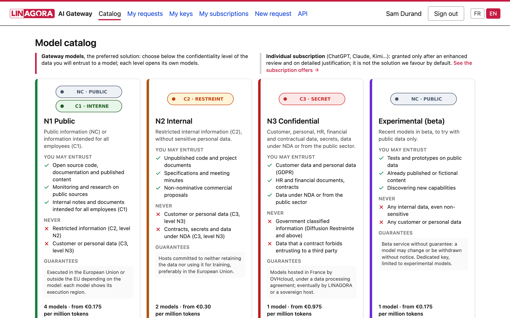
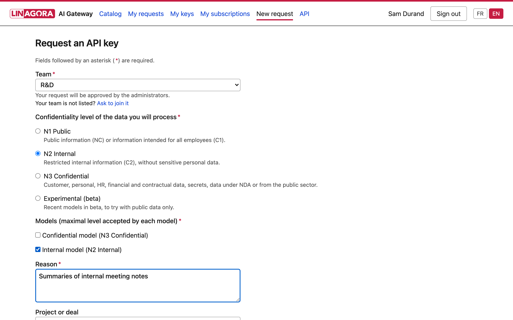
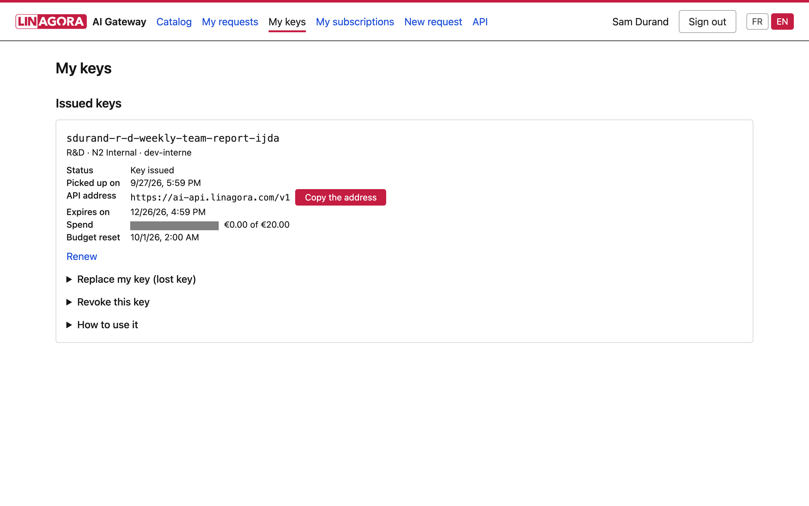
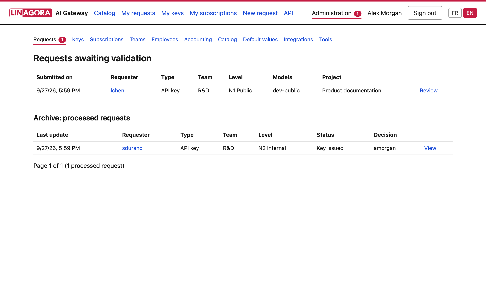
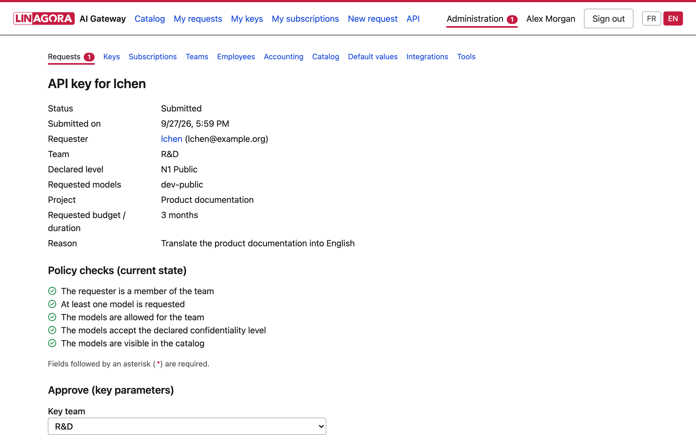
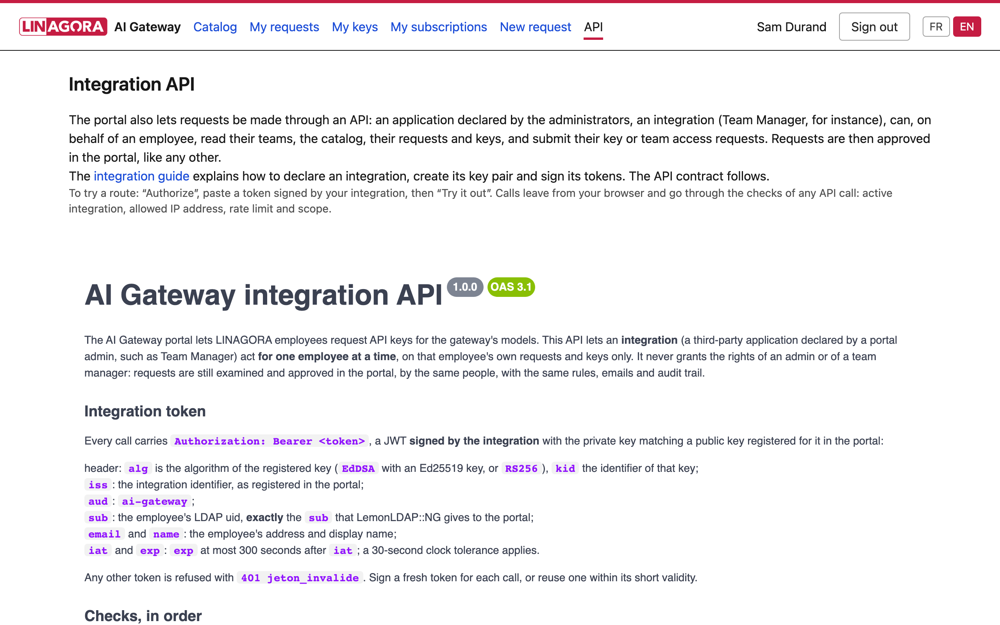
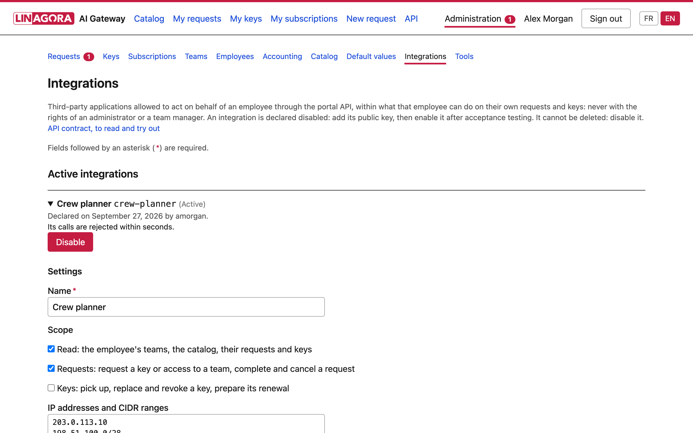
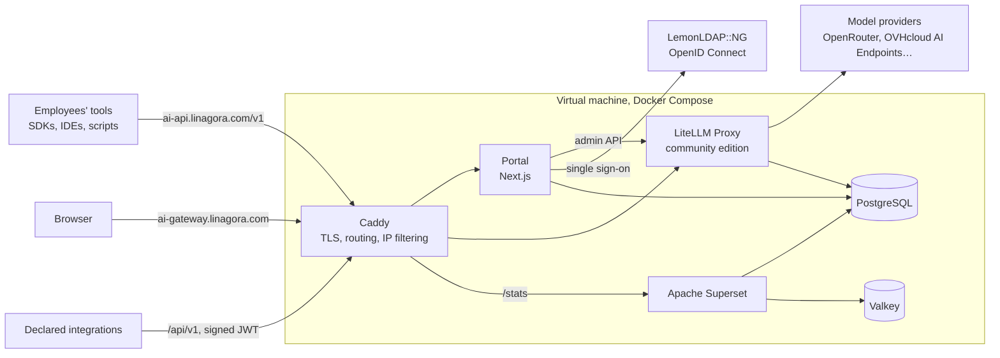

<div align="center">


# LINAGORA AI Gateway

**One OpenAI-compatible endpoint for a whole company, with API keys requested and approved in a portal,
a budget per key, and data confidentiality rules enforced model by model.**

[](LICENSE)
[](https://github.com/BerriAI/litellm)
[](https://nextjs.org)
[](https://www.postgresql.org)
[](#features)

[Features](#features) · [Screenshots](#screenshots) · [Architecture](#architecture) · [Getting started](#getting-started) · [Integration API](#integration-api) · [Contributing](#contributing)

</div>

<br>



## Overview

LINAGORA AI Gateway gives every LINAGORA employee access to generative AI models through a single
OpenAI-compatible endpoint, while keeping control over which data goes to which model.

An employee asks for an API key in the portal and declares the confidentiality level of the data they will
process. An administrator, or the manager of their team, approves the request with a budget and a validity
period. Each level only opens the models whose hosting guarantees fit it: models served worldwide for public
information, models hosted in France for customer and personal data.

The gateway runs the community edition of [LiteLLM Proxy](https://github.com/BerriAI/litellm). The portal,
built with Next.js, handles requests, approvals, keys, budgets, teams and reporting. Everything is
self-hosted on a single virtual machine with Docker Compose.

## Features

### For employees

- **Model catalog by confidentiality level.** N1 Public, N2 Internal, N3 Confidential and Experimental: for
  each level, what may and may not be entrusted to it, the hosting guarantees, and each model's execution
  region and price per million tokens.
- **Key requests with a declared data level.** Team, level, models, reason, project and requested duration,
  with an explicit commitment not to submit data above the declared level.
- **Self-service keys.** Pick up an approved key, follow spend against budget and the expiry date, renew,
  replace a lost key or revoke it, with ready-to-use examples in curl, Python and JavaScript.
- **Teams and subscriptions.** Ask to join a team; as an exception, request an individual subscription
  (ChatGPT, Claude, Kimi…), granted after an enhanced review, with reimbursement of declared charges.
- **Bilingual.** The portal and its email notifications are available in English and French.

### For administrators and team managers

- **Approval workflow.** A review queue, the policy checks of each request, the budget, budget period and
  validity of the key; ask the requester for more information, approve or refuse. Team managers approve
  their team's requests, never their own.
- **Administration.** Keys, subscriptions, teams and managers, employees, the catalog (display names and
  descriptions in both languages, maximum level, visibility), default key values, and the accounting export
  of subscription charges.
- **Reporting.** [Apache Superset](https://superset.apache.org) dashboards of costs, requests and tokens by
  team, model and level.
- **Access checkpoint.** The portal's single sign-on session and uid allowlists guard the LiteLLM console and
  Superset, through Caddy's `forward_auth`.
- **Daily task.** Expiry reminders and expirations, run by the server's cron.
- **Model monitoring.** Every model visible in the catalog is probed through the same route as employees, every
  10 minutes by default (`SUPERVISION_INTERVAL_MINUTES`); administrators get an email after two consecutive failures and another on recovery, and a
  **Supervision** tab shows the state of each model. New models are picked up automatically.

### Gateway

- **One endpoint.** `https://ai-api.linagora.com/v1`, compatible with any OpenAI SDK; models are declared in
  the database and priced in euros.
- **Model allowlist.** OpenRouter models are allowlisted one by one, each routed only to the providers of its
  execution zone, without fallback; confidential data goes to models hosted in France on OVHcloud AI
  Endpoints.
- **Guard hook.** Requests may not switch model or provider through their parameters (fallbacks, provider
  preferences, plugins, presets), nor use the image and video APIs whose cost would escape key budgets.
- **Privacy by default.** Prompts and responses are never stored in spend logs, and per-request details are
  kept for 90 days.
- **Fast revocation.** A revoked key stops working within seconds.

### Integration API

- **Requests from other applications.** Applications declared by the administrators, such as a team
  management tool, act for one employee at a time: they read the employee's teams, the catalog, their
  requests and keys, and submit key or team access requests. Requests are still approved in the portal, with
  the same rules, emails and audit trail.
- **Defense in depth.** Short-lived JWTs signed by the integration (EdDSA with Ed25519, or RS256), scopes,
  IP allowlist, rate limit and an on/off switch per integration.
- **Documented contract.** OpenAPI 3.1 contract, Swagger UI in the portal and an integration guide in
  [English](portal/docs/INTEGRATIONS.en.md) and [French](portal/docs/INTEGRATIONS.md).

## Screenshots

**Request a key.** The declared data level filters the models that can be requested.



**My keys.** Endpoint, expiry, spend against budget, renewal, replacement and revocation.



**Approval queue.** Pending requests, then the archive of processed ones.



**Request review.** Policy checks, then the budget and validity of the key.



**Integration API.** The contract in Swagger UI, which can be tried with a signed token.



**Integrations.** Scopes, allowed addresses, rate limit and public keys of each application.



The screenshots are taken from the development environment, with fictional people and data, by
`npm run captures` (see [portal/dev/captures](portal/dev/captures/captures.spec.ts)).

## Architecture



Only Caddy publishes ports. Every other service stays on the internal Docker network.

| URL | Service |
|---|---|
| `https://ai-api.linagora.com/v1` | OpenAI-compatible endpoint (LiteLLM) |
| `https://ai-gateway.linagora.com/` | Portal |
| `https://ai-gateway.linagora.com/api/v1/` | Integration API of the portal |
| `https://ai-gateway.linagora.com/admin/` | LiteLLM console and admin API: allowed addresses, administrators only |
| `https://ai-gateway.linagora.com/stats/` | Superset: administrators and reporting readers |

### Stack

| Component | Role |
|---|---|
| [Caddy](https://caddyserver.com) 2 | Reverse proxy, automatic TLS, IP filtering, access checkpoint |
| [LiteLLM Proxy](https://github.com/BerriAI/litellm), community edition | OpenAI-compatible gateway: keys, budgets, spend logs, providers |
| Portal: [Next.js](https://nextjs.org) 16, [Auth.js](https://authjs.dev), [Prisma](https://www.prisma.io), [next-intl](https://next-intl.dev) | Requests, approvals, keys, teams, subscriptions, catalog, integration API |
| [PostgreSQL](https://www.postgresql.org) 18 | Databases of LiteLLM and of the portal, reporting views |
| [Apache Superset](https://superset.apache.org) 6 and [Valkey](https://valkey.io) 9 | Reporting dashboards and their cache |
| [LemonLDAP::NG](https://lemonldap-ng.org) | Single sign-on (OpenID Connect) |

Every third-party image is pinned by tag and digest, in [`infra/.env.example`](infra/.env.example) and the
portal's [`Dockerfile`](portal/Dockerfile); LiteLLM releases are checked with their cosign signature before
use.

## Getting started

### Run the portal locally

Requirements: Docker with Compose, Node.js 24, `jq` and `curl`. The development environment runs entirely on
your machine, with fictional data and no production key: LiteLLM serves demo models whose answers are
mocked.

```bash
cd portal
docker compose -f dev/docker-compose.yml up -d  # PostgreSQL, LiteLLM, mock OpenID provider, Mailpit, Caddy
./dev/seed-litellm.sh                           # demo models priced in euros and an "R&D" team
cp .env.example .env                            # development values
npm install
npx prisma generate && npx prisma migrate deploy
npm run dev                                      # http://localhost:3100
```

To sign in, the mock OpenID provider asks for a user name (the uid) and claims, such as
`{"email": "jdoe@example.org", "name": "Jane Doe"}`. The uids listed in `PORTAL_ADMIN_UIDS` (`.env`) are
administrators.

| Service | Address |
|---|---|
| Portal | http://localhost:3100 |
| Portal behind Caddy, as in production (integration API) | http://127.0.0.1:54600 |
| LiteLLM admin API | http://127.0.0.1:54400/admin |
| Mailpit, the emails sent by the portal | http://127.0.0.1:54825 |

### Deploy

[`docs/RUNBOOK-INSTALL.md`](docs/RUNBOOK-INSTALL.md) (in French) describes the installation on a virtual
machine, phase by phase, each with its checks: host preparation, DNS, secrets generated on the server,
version pinning and verification, core services, single sign-on, reporting and backups, acceptance, then the
portal. [`infra/`](infra) holds the files deployed on the server.

## Using the gateway

Once a key is picked up in the portal, any OpenAI-compatible client works. The model names are those of the
catalog.

```bash
curl https://ai-api.linagora.com/v1/chat/completions \
  -H "Authorization: Bearer $LINAGORA_API_KEY" \
  -H "Content-Type: application/json" \
  -d '{"model": "MODEL_NAME", "messages": [{"role": "user", "content": "Hello!"}]}'
```

```python
import os
from openai import OpenAI

client = OpenAI(base_url="https://ai-api.linagora.com/v1", api_key=os.environ["LINAGORA_API_KEY"])
reply = client.chat.completions.create(model="MODEL_NAME", messages=[{"role": "user", "content": "Hello!"}])
print(reply.choices[0].message.content)
```

## Integration API

The portal exposes a REST API under `/api/v1` so that other applications can submit requests on behalf of
an employee. An administrator declares each application in the portal, with its scopes, allowed addresses,
rate limit and public keys; the application then signs a short-lived token for each employee it acts for.

- Integration guide: [English](portal/docs/INTEGRATIONS.en.md), [French](portal/docs/INTEGRATIONS.md), also
  shown in the portal under **API**.
- Contract: [`openapi-v1.json`](portal/src/lib/integrations/openapi-v1.json) (OpenAPI 3.1), browsable by
  signed-in employees in Swagger UI at `/documentation/api`, and returned by the API itself at
  `GET /api/v1/openapi.json`.

In development, `node dev/integration-demo.mjs installer` declares a demo integration, and
`node dev/integration-demo.mjs jeton <uid>` signs a token with its private key, which stays out of the
repository:

```bash
curl -H "Authorization: Bearer $(node dev/integration-demo.mjs jeton jdoe)" http://127.0.0.1:54600/api/v1/me/teams
```

## Tests

Run from `portal/`. Integration and end-to-end tests need the development environment.

| Command | Scope |
|---|---|
| `npm test` | Unit tests: business rules, OpenID claims, integration tokens, address allowlists, rate limit, API contract |
| `npm run test:int` | Integration tests: services against the `portal_test` database, contract with the development LiteLLM |
| `npm run test:e2e` | End-to-end journeys in a browser (Playwright), emails checked in Mailpit |
| `npm run lint` | ESLint |
| `npm run captures` | Screenshots of this README |

## Repository layout

| Path | Content |
|---|---|
| [`infra/`](infra) | Files deployed on the server: Docker Compose, Caddy, LiteLLM configuration and hooks, PostgreSQL initialization and reporting views, Superset, operation scripts (bootstrap, secrets, backups and restore tests, model synchronization, smoke tests) |
| [`portal/`](portal) | The portal: Next.js application, Prisma schema and migrations, tests, development environment |
| [`docs/`](docs) | Installation runbook, pointer to the integration guide, screenshots |

## Roadmap

- Traces of the gateway's calls with [Langfuse](https://langfuse.com), under `/traces/`.
- Key operations in the integration API: pick up, replace and revoke a key, prepare its renewal.

## Contributing

Contributions are welcome: see [CONTRIBUTING.md](CONTRIBUTING.md). The code base uses French for its domain
vocabulary, comments, commit messages and most documentation; the portal and the integration guide are
available in English and French.

## Security

Please do not report security vulnerabilities through public issues. See [SECURITY.md](SECURITY.md) to
report them privately.

## License

Copyright © 2026 [LINAGORA](https://linagora.com).

LINAGORA AI Gateway is free software, released under the [GNU Affero General Public License v3.0](LICENSE).
